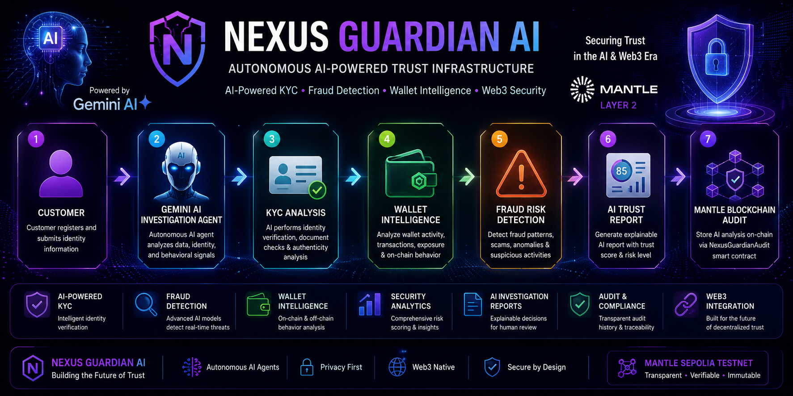

 # 🛡️ Nexus Guardian AI
<p align="center">
<p align="center">
  
</p>
## 🧠 AI Investigation Architecture
<p align="center">
  
</p>


</p>

## 📸 Product Screenshots

### 🏠 Dashboard


### 🪪 AI KYC Investigation


### 👛 Wallet Intelligence


### 🛡 Security Center


### 🤖 AI Investigation Report


## ⛓️ Web3 & Mantle Blockchain Integration

Nexus Guardian AI extends AI-powered fraud intelligence with a transparent on-chain audit layer built on Mantle Sepolia.

After Gemini AI completes customer risk analysis, key trust information can be recorded on-chain through the NexusGuardianAudit smart contract, providing immutable and transparent AI audit records.

### AI + Blockchain Workflow

```
Customer Investigation
          ↓
 Gemini AI Analysis
          ↓
 Trust Score & Risk Decision
          ↓
 storeAIAnalysis()
          ↓
 NexusGuardianAudit Smart Contract
          ↓
 Mantle Sepolia Blockchain
```

---

## 🔐 Mantle Smart Contract

**Network:** Mantle Sepolia Testnet

**Contract Name:** NexusGuardianAudit

**Contract Address:**
0x7DA14feBEF5bc9431D7e1D47A7Ee56E94B10505e

### On-chain AI Function

`storeAIAnalysis()`

Stores:

* Customer ID
* AI trust score
* Risk level
* AI decision
* Timestamp

The smart contract source code has been verified on Mantle Explorer, ensuring transparency and public verification of the AI audit layer.

---

## 🏆 Web3 Innovation

Nexus Guardian combines Artificial Intelligence with blockchain technology to create a next-generation digital trust infrastructure.

Key innovations include:

* AI-powered fraud investigation
* Explainable AI trust decisions
* On-chain audit trail
* Transparent compliance records
* Web3 security infrastructure
* Mantle blockchain integration
